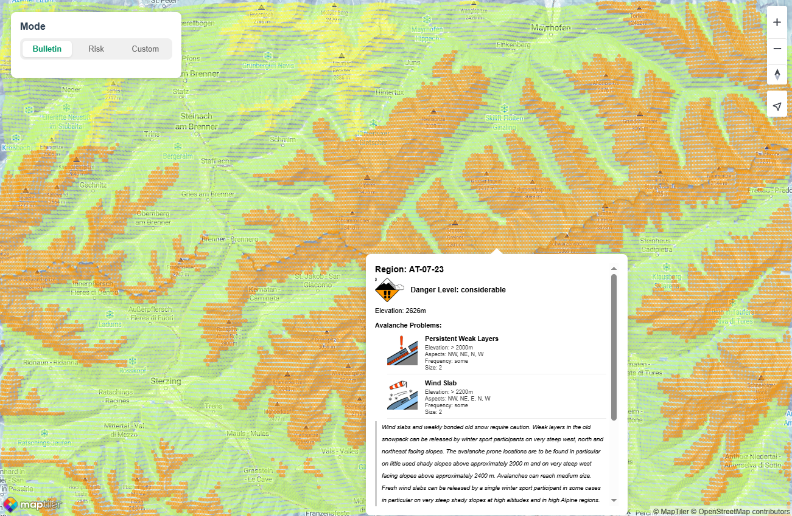
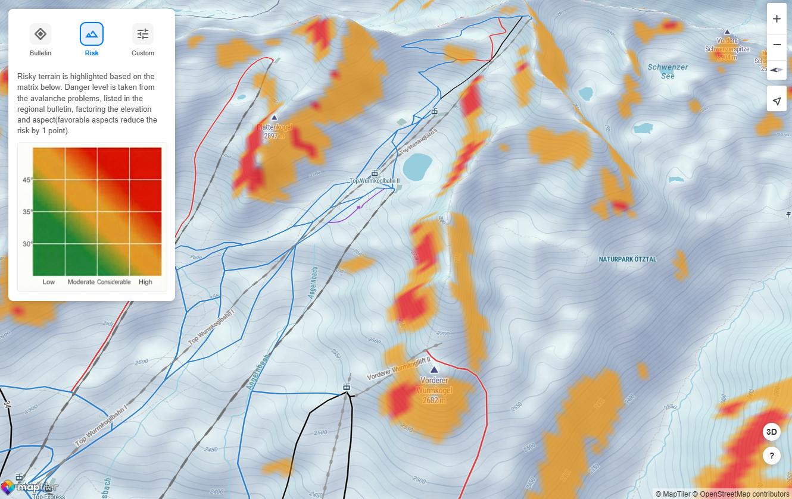

# [AvaAwa.eu](https://avaawa.eu/?utm_source=github)
A tool to assess avalanche terrain, based on the slope parameters and regional avalanche forecast. Key advanage to the tools existing on the market is the highlight of the avalanche danger not only based on the region, but also considering the aspect and elevation relevant to the avalanche problems, specified in the bulletin. The information on the specific problems is avaiiable at a glance, looking at a particular route you are planning.




## Features
- **Avalanche Bulletin Mode**: Fetches and displays real-time avalanche danger levels from official bulletins
- **Risk Mode**: Highlights risky terrain, as per the regional avalanche bulletin, based on the following parameters of the relevant problems(see the matrix below):
  - Danger level
  - Elevation range
  - Aspect
  - Steepness


- **Custom Mode**: Interactive tools to filter terrain based on:
  - Elevation range (min/max)
  - Slope angle(>30°, >35°, >40°)
  - Aspect 

**Disclaimer**: This tool is for informational purposes only. It does not replace official avalanche bulletins or professional danger assessments. You are solely responsible for your safety; entering the backcountry involves significant risk.

## Tech Stack

- **Framework**: [Vite](https://vitejs.dev/) + [TypeScript](https://www.typescriptlang.org/)
- **Backend**: [Node.js](https://nodejs.org/) + [Express](https://expressjs.com/)
- **Map Engine**: [MapTiler SDK](https://docs.maptiler.com/sdk-js/)
- **Data Fetching**: Axios
- **Data Sources**: 
  - Avalanche Bulletins: 
  1. [avalanche.report](https://avalanche.report)
  2. [SLF](https://slf.ch)
  - Region Boundaries: [regions.avalanches.org](https://regions.avalanches.org)

## Getting Started

### Prerequisites

- Node.js (v16 or higher)
- A MapTiler API Key (configure in `src/main.ts` or `.env` if applicable)

### Installation

1. Clone the repository.
2. Install dependencies:
   ```bash
   npm install
   ```

### Running the App

Start the development environment (Backend API + Frontend):
```bash
npm run dev
```

Build and run for production:
```bash
npm run build
npm run server
```

## Configuration

Key application settings can be found in `src/config.ts`, including:
- Map defaults (center, zoom)
- Visualization colors and thresholds
- Grid generation parameters
- API endpoints
